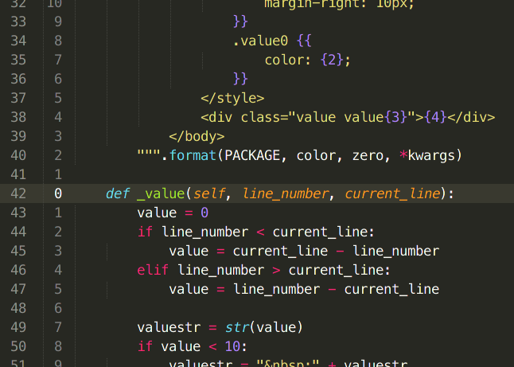

# RelativeLineNumbers

A Sublime Text plugin for relative line numbers inspired by VintageLines. This plugin use Phantoms instead Regions. This means that it's much more configurable.

This plugin has been based with a command. This means that you should press a key for trigger it. Default key binding is:

```
    Alt+l
```

You can change it editing your key bindings.

```
[
    { "keys": ["alt+l"], "command": "relative_line_numbers" }
]
```

After the command has been executed, the relative line numbers is cleared after 1 second. You can modify this value in your preferences.


# Preferences
| Option | Description | Default value |
|--------|-------------|---------------|
| relative_line_numbers_enabled | For enable/disable plugin | true |
| relative_line_numbers_color | Foreground color for relative line numbers value | gray |
| relative_line_numbers_zero_color | Foreground color for zero line value | white |
| relative_line_numbers_clear_timeout | Waiting time before to clear | 1000 |

# Screenshots

